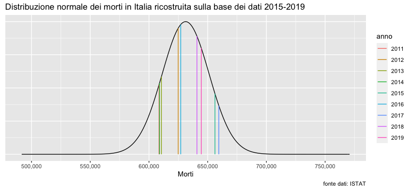

Come si può intuire dal titolo, l'obiettivo sarà cercare di rispondere alla famosa domanda che da un anno ci perseguta tramite un'analisi dei dati: sono morti DI Covid o CON Covid?. Per rispondere a questa domanda dobbiamo prima fare uno step indietro.

### Era una banale influenza?

Ebbene sì. Molti sostengono fosse una banale influenza e che quindi l'impatto che ha avuto sul nostro paese sia irrisorio. A questo proposito, ci viene in aiuto con questo bellissimo [file](https://www.istat.it/it/files//2020/03/Dataset-decessi-comunali-giornalieri-e-tracciato-record_5marzo.zip) nel quale sono riportati i dati relativi alle morti dal 2011 al 2020. Per confrontare il numero dei morti del 2020 con quello degli altri anni, si guarda la distribuzione delle morti dal 2011 al 2019. Tramite lo Shapiro-test per la normalita vediamo che la distribuzione è normale (W = 0.90009, p-value = 0.2525), ne calcoliamo quindi media e deviazione standard (631,235.8 e 19,944.2 rispettivamente) e ci costruiamo un grafico della distribuzione.
